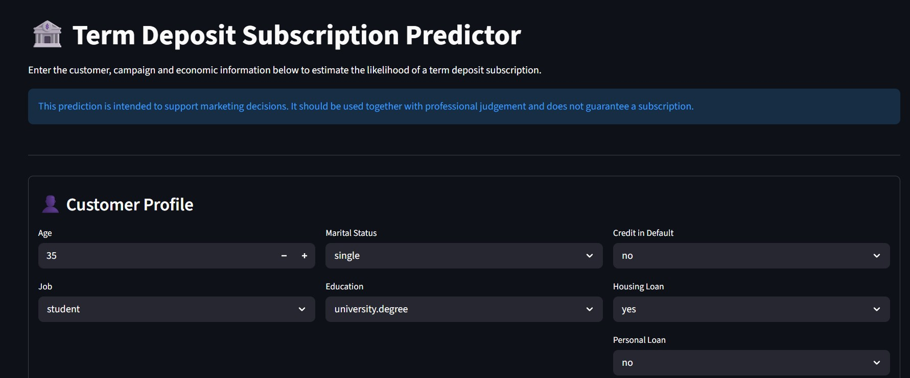
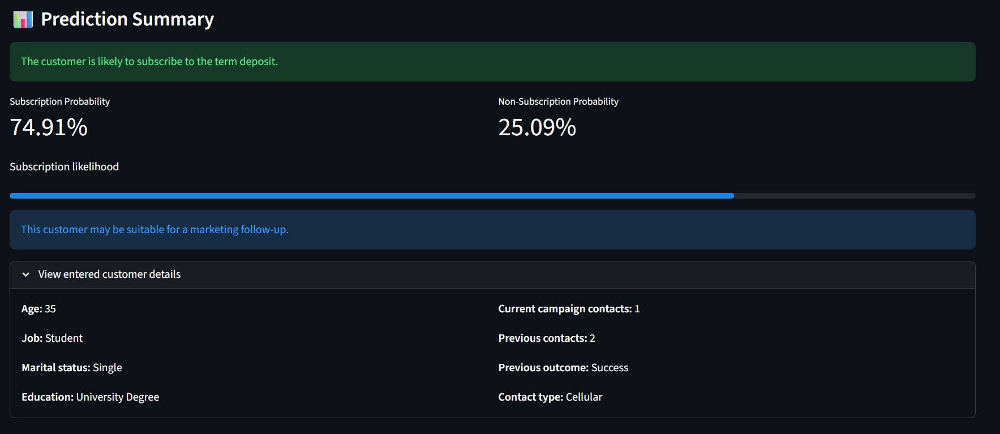
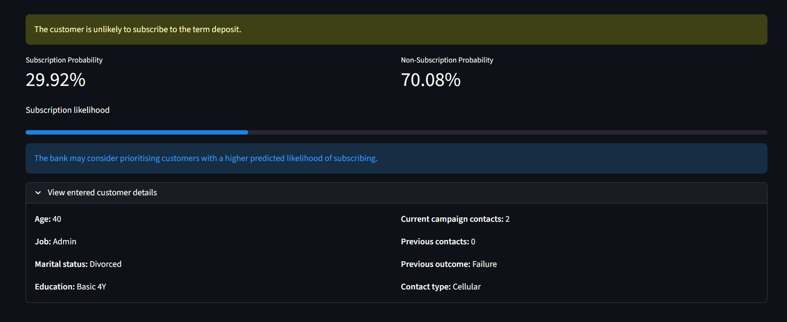

# 📈 Bank Marketing Subscription Prediction

## 🚀 Project Highlights

- Built, evaluated, and compared **four machine learning classification models**
- Conducted comprehensive **Exploratory Data Analysis (EDA)**
- Applied data preprocessing and feature engineering techniques
- Optimised the final Random Forest model using **RandomizedSearchCV**
- Deployed the trained model as an interactive **Streamlit** web application

---

# 📖 Project Overview

This project was developed as part of the **Machine Learning for Developers** module.

The objective of this project is to develop a machine learning model capable of predicting whether a customer is likely to subscribe to a bank term deposit. The solution helps banks identify potential customers before conducting direct marketing campaigns, allowing marketing resources to be allocated more effectively.

The project follows the complete machine learning development lifecycle, including exploratory data analysis (EDA), data preprocessing, model development, hyperparameter tuning, model evaluation, and deployment using Streamlit.

---

# 💼 Business Problem

Banks regularly conduct direct marketing campaigns to promote term deposits. Contacting every customer is both time-consuming and costly, while many customers may have little interest in subscribing.

By predicting which customers are more likely to subscribe, banks can focus their marketing efforts on high-potential customers, improving campaign effectiveness while reducing operational costs.

This project formulates term deposit subscription prediction as a **binary classification problem**.

---

# 📊 Dataset

The project uses the **Bank Marketing Dataset** obtained from the **UCI Machine Learning Repository**.

| Attribute | Description |
|-----------|-------------|
| Dataset | Bank Marketing Dataset |
| Source | UCI Machine Learning Repository |
| Number of Records | 41,188 |
| Number of Input Features | 20 |
| Target Variable | y |
| Problem Type | Binary Classification |

The dataset contains customer demographic information, previous marketing campaign details, and economic indicators collected during direct marketing campaigns conducted by a Portuguese banking institution.

---

# 🤖 Machine Learning Approach

The project follows a standard supervised machine learning workflow:

- Exploratory Data Analysis (EDA)
- Data preprocessing
- Feature engineering
- Model training
- Model comparison
- Hyperparameter tuning using RandomizedSearchCV
- Streamlit deployment

Four classification algorithms were evaluated:

- Logistic Regression
- Decision Tree
- Random Forest
- Gradient Boosting

---

# 🏆 Final Model

After comparing multiple machine learning models, the **Random Forest** classifier was selected as the final deployment model.

The model was further optimised using **RandomizedSearchCV**, resulting in improved predictive performance. It was chosen based on its overall performance and suitability for the business problem.

---

# 🌐 Streamlit Application

The trained machine learning model was deployed using **Streamlit** to provide an interactive prediction tool.

### Features

- Customer information input
- Marketing campaign information input
- Economic indicator input
- Real-time subscription prediction
- Prediction probability display
- Recommendation based on prediction results
- User-friendly interface suitable for non-technical users

---

## 🖼️ Application Preview

### Home Page



---

### Successful Prediction



---

### Unsuccessful Prediction



# 📂 Repository Structure

```text
stanly-tan/
│
├── Images/
│   ├── Homepage.jpg
│   ├── Successful.jpg
│   └── Unsuccessful.jpg
│
├── BankMarketing.xlsx
├── final_random_forest_model.pkl
├── model_feature_columns.pkl
├── one_hot_encoder.pkl
├── project.ipynb
└── README.md
```

---

# ⚙️ Installation

Clone the repository:

```bash
git clone https://github.com/yourusername/Bank-Marketing-Prediction.git
```

Navigate to the project folder:

```bash
cd Bank-Marketing-Prediction
```

Install the required dependencies:

```bash
pip install -r requirements.txt
```

Run the Streamlit application:

```bash
streamlit run app.py
```

---

# 🛠️ Technologies Used

- Python
- Streamlit
- Pandas
- NumPy
- Scikit-learn
- Joblib
- Matplotlib

---

# 📚 References

- UCI Machine Learning Repository – Bank Marketing Dataset
- Scikit-learn Documentation
- Streamlit Documentation
- Pandas Documentation
- NumPy Documentation

---

# 👨‍💻 Author

**Stanly Tan**